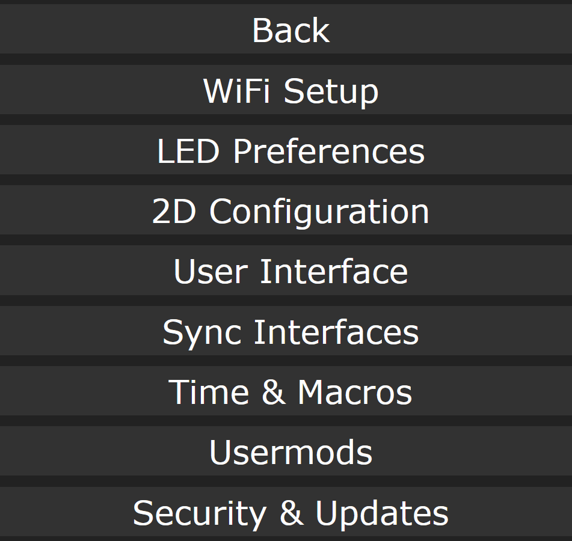

## The basics 
A) How to configure a matrix in wled 

Audio Reactive WLED is a possibility of using WLED controllers in such a way that the LEDs react to music and light up in time. First time this was implemented by a [Sound Reactive Fork](https://github.com/atuline/WLED). As of WLED version 0.14.0-beta1 an usermod is available for original WLED too.
Currently only ESP32 microcontrollers are supported.

## Hardware required

The audio must be "feed" into the microcontroller. There are basically two options: using microphones or line-in adapters.

### Microphones supported

Three microphone types are supported:

#### 1. Analog microphones

Examples are MAX4466 (not really good) and MAX9814 (slightly better). These microphones are easy to use: you just have to connect 3.3V, GND and the analog output from the microphone to an ADC input (Analog-to-Digital Converter) of ESP32. However, the big disadvantage is the quality: both from the microphones themselves and from the ADCs integrated into microcontrollers, which are actually not well suited for audio processing and highly influenced by the power supply noise.

!!! info "Analog microphones and analog buttons (potentiometers) rule out each other"
    WLED can use analog microphones or [analog buttons](/features/macros/#analog-button) but not both at the same time!

#### 2. I2S digital microphones

Examples are INMP441 and ICS-43434/ICS-43432. These have an integrated ADC and already output a digital signal. The advantage is the best possible quality. The disadvantage is higher complexity (you need several PINs for a digital signal). For proper trouble-free operation keep wires between the microphone and ESP32 as short as possible and solder them properly.

There are also some commercial controllers with integrated digital microphone or plug-in capability available. Be sure to setup correct GPIOs according to the information you typically will find printed on the board or in user manual.

#### 3. PDM microphones

An example is SPM1423. In principle, these are also digital microphones with an integrated Sigma-Delta ADC. They are slightly cheaper than I2S microphones, require one PIN less and the quality is quite good.

### Line-In options

Similar to microphones there are options for analog or digital line-in adapters. In both cases you use line-out (AUX) or headphone-out signal of your sound system/TV/Smartphone/etc.

#### 1. Analog line-in option

At least a simple analog circuit as shown below is required to prepare the analog line-out signal and to feed it to the ADC converter of ESP32 microcontroller. In this case, the whole thing works like with an analog microphone. The quality is not the best here either because the ESP32 ADC is not particularly good at converting audio signals and the signal conditioning circuitry is very simple, but not very good. In addition, the sensitivity can be quite poor, so that the whole thing only works at a higher volume of the signal.

In some cases, you can do it without this circuit and connect the GND of the audio source and an audio channel (left or right) directly to ESP32 ADC Pin (GND and analog input, e.g. GPIO36 pin on the ESP32). This solution is rather quite dirty workaround and might work well or not at all.

#### 2. Line-in to I2S adapter

Line-in to I2S adapter converts the analog line-out or headphone signal into a digital I2S signal that can be proceed by ESP32. There are some general or for WLED specially developed analog-to-I2S adapters based on for example CirrusLogic CS5343, TI PCM1808 or es7243 chips on the market. In this case, the whole thing works like with a digital I2S microphone. The only difference to I2S microphone is that you at least need an extra PIN for MCLK (Master Clock) signal, which can only be generated by the ESP32 on GPIOs 0, 1 or 3. The other complication is that MCLK is a high frequency signal and must be wired extremely accurate and have short wires. Some adapter types also require more additional signals. For stability it is better to use ready-to-use controller with special Line-In to I2S adapter or DIY PCB design where you can integrate general analog-to-I2S adapter directly without long wires.

For some more details please refer to [Sound Reactive WLED WIKI](https://github.com/atuline/WLED/wiki)

## Software required

Because audio reactive capability is currently implemented as a usermod, you need WLED compiled with this usermod included or use Sound Reactive WLED fork. The [official WEB-based WLED installer](https://install.wled.me/) does not include original WLED with audio reactive usermod, but offers Sound Reactive WLED as an option. The [unofficial WEB-based WLED installer](https://wled-install.github.io/) offers more options including original WLED with audio reactive usermod.
